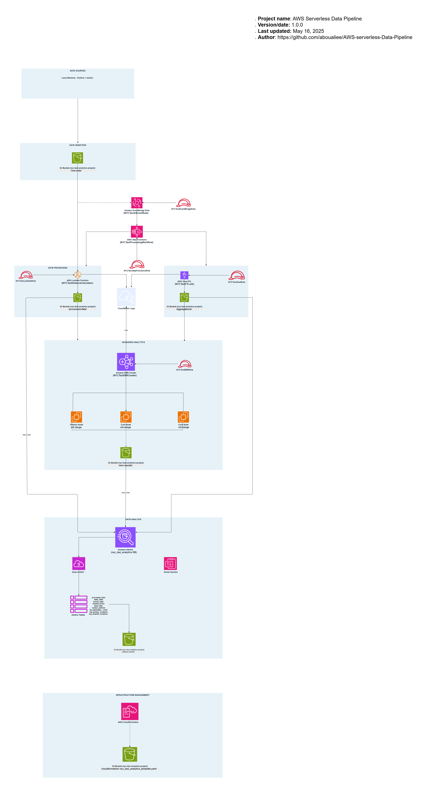

# NYC Taxi Trip Data Analytics – Serverless AWS Pipeline

A comprehensive serverless data processing pipeline built on AWS that analyzes NYC taxi trip data to derive business insights. This project demonstrates advanced AWS cloud architecture and serverless data processing techniques.

## Overview

This solution is designed as a fully serverless architecture on AWS, optimized for scalability, automation, and cost-efficiency. The platform automates data ingestion, transformation, analytics, and querying through integrated AWS services and custom logic, triggered by event-based workflows.

Key objectives:
- Enable continuous ingestion and transformation of taxi trip data
- Deliver operational and business insights through SQL-based querying
- Use infrastructure-as-code for reproducibility and automation

## Features

- Event-Driven Pipeline: Triggered by file uploads to Amazon S3
- Fully Serverless: Managed services with no need to manage servers
- Scalable Processing: Lambda, Glue, and EMR adapt to processing needs
- Real-Time Querying: Athena allows interactive SQL queries on data stored in S3
- Modular Architecture: Logical separation of ingestion, processing, analytics
- Cloud-Native Logging: CloudWatch Logs integration for observability

## System Architecture

The following diagram illustrates the architecture of the pipeline:

### Architecture Components

- **Local Machine**: Uploads data to S3 using Python and boto3
- **Amazon S3**: Serves as the central data lake
- **Amazon EventBridge**: Triggers processing workflows
- **AWS Step Functions**: Orchestrates data processing
- **AWS Lambda**: Enhances raw data with distance metrics
- **AWS Glue**: Performs ETL and aggregation
- **Amazon EMR**: Executes Spark-based advanced analytics
- **Amazon Athena**: Enables querying and analysis
- **Amazon CloudWatch**: Collects logs for monitoring
- **AWS CloudFormation**: Deploys infrastructure as code

## Insights Produced

- Busiest zones and optimal taxi stand locations
- Peak trip hours and slow periods
- Vendor performance comparisons
- Route efficiency and optimization metrics

---

## How to Use

1. Upload taxi data to S3 using `boto3`
2. EventBridge triggers Step Functions workflow
3. Follow the logs and results via Athena or CloudWatch

---

